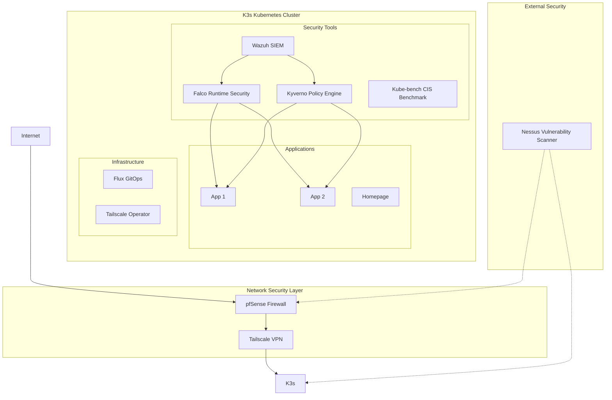

# 📖 Project Overview
This project aims to build a secure and accessible Kubernetes-based homelab environment combined with Tailscale VPN for private, encrypted access over the internet. The setup focuses on defense-in-depth security practices with comprehensive monitoring, vulnerability assessment, and policy enforcement.


## Architecture Overview

## Demo Setup: Local K3s Cluster with Flux via Vagrant & Ansible

This project sets up a local **Kubernetes (K3s)** cluster using **Vagrant**, **Ansible**, and a **Makefile**

---

### ✅ Requirements

Make sure the following tools are installed on your host machine:

- [Vagrant](https://www.vagrantup.com/)
- [VirtualBox](https://www.virtualbox.org/) (or another Vagrant-compatible provider)
- [Ansible](https://www.ansible.com/)
- [GNU Make](https://www.gnu.org/software/make/)


---


#### 1. Set up Tailscale OAuth
[Go to Tailscale setup](#tailscale-setup)

#### 2. Set up env vars
- Copy `.env.example` to `.env`:
  ```bash
  cp .env.example .env  
  ```
- Edit `.env` and fill in the required values:
   - Tailscale Client ID
   - Tailscale Client Secret
   - Tailscale Domain

#### 2. Start the VM
```bash
make up
```
#### 3. Bootstrap the VM
```bash
make bootstrap
```
#### 4. Access the Home Page

Once the cluster is bootstrapped, open the following URL in your browser:
http://homepage.YOUR_DOMAIN
> Replace `YOUR_DOMAIN` with the actual domain you configured in your `.env` file.

#### 5. (Optional) Get the kubeconfig
Run the following command to extract kubeconfig at project root
```bash
make kubeconfig
```
### Tailscale Setup

The Tailscale operator requires OAuth credentials to function. These credentials need to be created manually as a Kubernetes secret. Follow these steps:

1. Create a Tailscale OAuth client:
   - Go to https://login.tailscale.com/admin/settings/oauth
   - Click "Create OAuth Client"
   - Copy the Client ID and Client Secret


2. Set Up the Tailscale Tag
- > ⚠️ This is required for the Tailscale K8s Operator to function.
  - Go to https://login.tailscale.com/admin/acls/file
  - Add the following to your ACL file:
  ```json
	"tagOwners": {
		"tag:k8s-operator": ["autogroup:admin"],
	},
   ```
   - Save and apply the ACL changes.

## Storage
TODO
## Security

This homelab implements a multi-layered security approach covering network, infrastructure, runtime, and compliance aspects.
Security Architecture
The security stack follows defense-in-depth principles:

1. **Network Security** - Perimeter protection and secure access
2. **Infrastructure Security**- Kubernetes hardening and compliance
3. **Runtime Security** - Real-time threat detection and response
4. **Policy Enforcement** - Automated security policy management
5. **Vulnerability Managemen**t - Regular security assessments

### Security Tools

#### Network Security
##### pfSense Firewall
**Purpose**: Network perimeter security and traffic filtering

**Features**:
- Stateful packet filtering
- VPN termination
- Intrusion detection/prevention (IDS/IPS)
- Traffic shaping and monitoring


**Integration**: Acts as the primary gateway protecting the entire homelab infrastructure

#### Tailscale VPN

**Purpose**: Zero-trust network access and secure remote connectivity

**Features**:
- WireGuard-based mesh VPN
- Identity-based access control
- End-to-end encryption
- Automatic key rotation

**Integration**: Provides secure access to Kubernetes services without exposing them to the internet

### Vulnerability Management
#### Nessus Vulnerability Scanner

**Purpose**: Comprehensive vulnerability assessment and compliance scanning

**Features**:
- Network and host vulnerability scanning
- Configuration auditing
- Compliance reporting (PCI DSS, NIST, CIS)
- Risk prioritization


**Usage**: Regular scans of the entire infrastructure to identify security weaknesses

### Security Information and Event Management (SIEM)
#### Wazuh

**Purpose**: Centralized security monitoring, log analysis, and threat detection

**Features**:
- Log aggregation and analysis
- File integrity monitoring (FIM)
- Rootkit detection
- Security compliance monitoring
- Integration with threat intelligence feeds

**Deployment**: Monitors both Kubernetes cluster activities and host-level events

### Runtime Security
#### Falco

**Purpose**: Runtime security monitoring for Kubernetes workloads
**Features**:
- Anomaly detection using syscall monitoring
- Kubernetes audit event analysis
- Real-time alerting for suspicious activities
- Custom rule engine for threat detection

**Integration**: Sends alerts to Wazuh SIEM for centralized security event management

### Policy Enforcement
#### Kyverno

**Purpose**: Kubernetes-native policy engine for security and governance
**Features**:
- Pod Security Standards enforcement
- Resource validation and mutation
- Image scanning integration
- Network policy automation
- Configuration drift prevention


**Policies Implemented**:
- Require non-root containers
- Enforce resource limits
- Block privileged containers


### Compliance & Hardening
**Kube-bench** (Planned Implementation)
**Purpose**: CIS Kubernetes Benchmark compliance verification
**Features**:
- Automated security configuration checks
- CIS benchmark compliance reporting
- Integration with CI/CD pipelines
- Remediation guidance

**Future Integration**: Will be implemented to ensure Kubernetes cluster adheres to security best practices

## High Availability

This homelab uses HAProxy and Keepalived to provide high availability for the Kubernetes API server. This ensures that the cluster remains accessible even if one of the HAProxy servers fails.

### How It Works

The high availability setup is based on a floating virtual IP (VIP) address that is managed by Keepalived. Here's a step-by-step breakdown of how it works:

1.  **VRRP Group:** The two HAProxy VMs, both running Keepalived, form a VRRP (Virtual Router Redundancy Protocol) group. This group is identified by a unique `virtual_router_id`.

2.  **Master and Backup:** Within the VRRP group, one server is elected as the **MASTER** and the other as the **BACKUP**. This election is based on the `priority` value in the Keepalived configuration. The server with the higher priority becomes the MASTER.

3.  **ARP Announcements:** The MASTER server sends out ARP (Address Resolution Protocol) announcements to the network. These announcements tell the network switch to associate the virtual IP address with the MASTER server's MAC address.

4.  **Network Switch:** The network switch updates its MAC address table, and all traffic destined for the virtual IP is sent to the MASTER HAProxy VM.

5.  **Health Checks:** The MASTER and BACKUP servers constantly communicate with each other. The BACKUP server listens for advertisements from the MASTER.

6.  **Failover:** If the BACKUP server stops hearing from the MASTER, it assumes the MASTER is down.

7.  **Taking Over:** The BACKUP server transitions to the MASTER state and sends out its own ARP announcements, claiming the virtual IP.

8.  **Switch Update:** The network switch updates its MAC address table again, and all traffic for the virtual IP is sent to the new MASTER.

This entire process happens automatically and very quickly, ensuring a seamless failover from the perspective of the clients accessing the Kubernetes API.